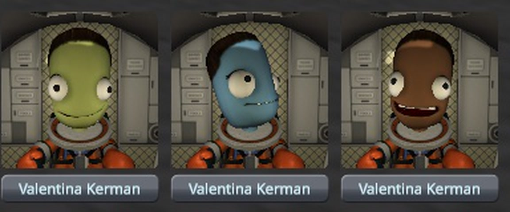
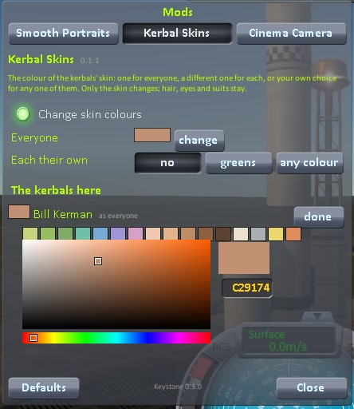

# Kerbal Skins

The colour of the kerbals' skin: one colour for everyone, a different one for each kerbal, or your own
choice for any one of them. Only the skin changes; hair, eyes, mouths and suits stay as they are.

For Kerbal Space Program 1.12.x. Needs [Keystone](https://github.com/IshiakiZ/ksp-keystone), which comes in the download.

## Install

Copy the `Keystone` and `KerbalSkins` folders from the download's `GameData` into your KSP `GameData`.

## Use

Open the Keystone window (the keystone button on the game's toolbar, or Option-K on a Mac, Alt-K
elsewhere), turn to **Kerbal Skins** and switch on **Change skin colours**.

* **Everyone**: the colour of every kerbal who has not been given one of their own.
* **Each their own**: gives every such kerbal a different colour, always the same for the same name, from
  eight greens or from sixteen colours of any kind.
* **The kerbals here**: click a kerbal's colour box, then click or drag on the gradient, pick from the
  row of ready colours, or type a colour as six hex digits. `as the rest` takes it away again.

A kerbal's own colour is remembered by name, in every save. The cockpit view, the portraits and the
kerbal outside the ship all show it.

## Good to know

* It works in flight, with the game's stock heads. Heads from other mods are left alone.
* Made and tried on a Mac. It is plain C# with no shader or library of its own, so it should work on
  Windows and Linux as well, but it has **not been run** there.

More: [how it works and what it costs](https://github.com/IshiakiZ/ksp-kerbal-skins/wiki/How-it-works),
[choosing colours](https://github.com/IshiakiZ/ksp-kerbal-skins/wiki/Choosing-colours),
[limits](https://github.com/IshiakiZ/ksp-kerbal-skins/wiki/Limits),
[building it yourself](https://github.com/IshiakiZ/ksp-kerbal-skins/wiki/Building).

## Licence

[MIT](LICENSE).
